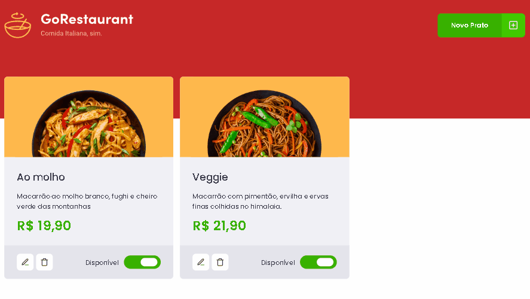

<div align='center'>
  
</div>

# Sobre o projeto 💬

O **DashboardRestaurant** é uma aplicação web desenvolvida na Rocketseat, para gerenciar os pratos disponíveis de um restaurante.

## Funcionalidades 🧠

###  📕 A aplicação contém as seguintes funcionalidades:

- [x] Adicionar um novo prato.
- [x] Edita o prato selecionado.
- [x] Exclui o prato selecionado.
- [x] Desabilita o prato caso tenha falta de ingredientes

## Pré-requisitos
#### Antes de começar, é bom ter instalado em sua maquina as seguintes ferramentas:
- [x] [GIT](https://git-scm.com/)
- [x] [VSCode](https://code.visualstudio.com/)
- [x] [NodeJs](https://nodejs.org/en/)

### Rodando o Projeto 📖

```bash
# Clone para este repositório
$ git clone <https://github.com/Pedro-AugusCoelho/DashboardRestaurant.git>

# Acesse a pasta do projeto no terminal/cmd
$ cd dashboardRestaurant

# Instale as dependências
$ npm/yarn install

# Inicie a FakeApi para puxar os dados
$ npm/yarn server
# O servidor iniciará na porta:3333

# Execute a aplicação em modo de desenvolvimento
$ npm/yarn start
# A aplicação iniciará na porta:3000 - acesse <http://localhost:3000>
 
```

## Tecnologias 🛠

Desenvolvido utilizando as seguintes tecnologias:

- [REACT.JS](https://reactjs.org/)
- [TYPESCRIPT](https://www.typescriptlang.org/)
- [AXIOS](https://axios-http.com/)
- [STYLED-COMPONENTS](https://styled-components.com/)
- [YUP](https://www.npmjs.com/package/react-yup)

## Desenvolvido ##

- [Rocketseat](https://www.rocketseat.com.br/index)

****************

<p align="center">Feito por: Pedro Augusto & Rocketseat</p>
